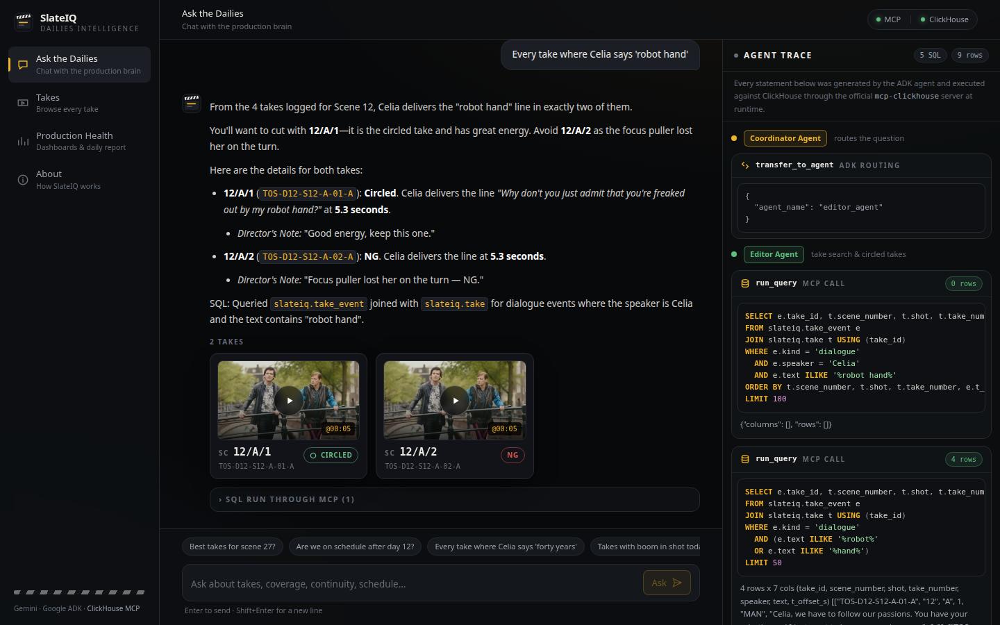
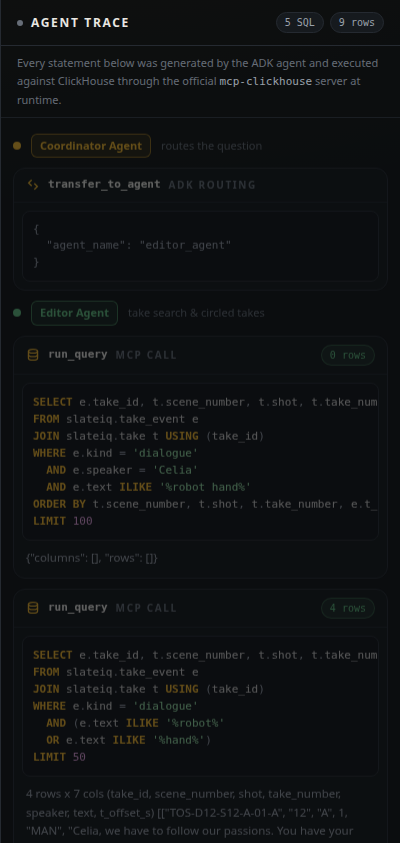
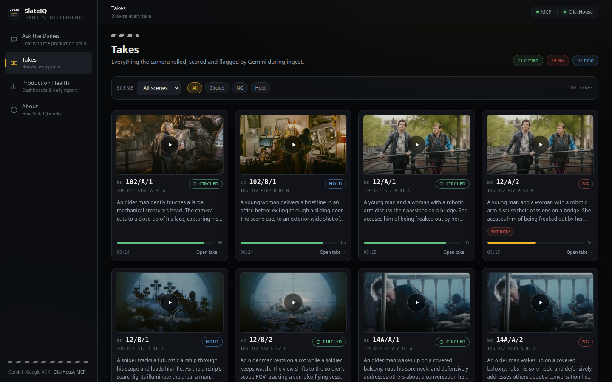
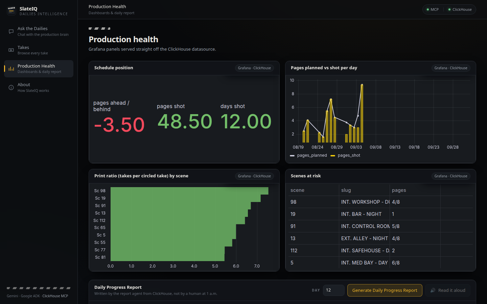
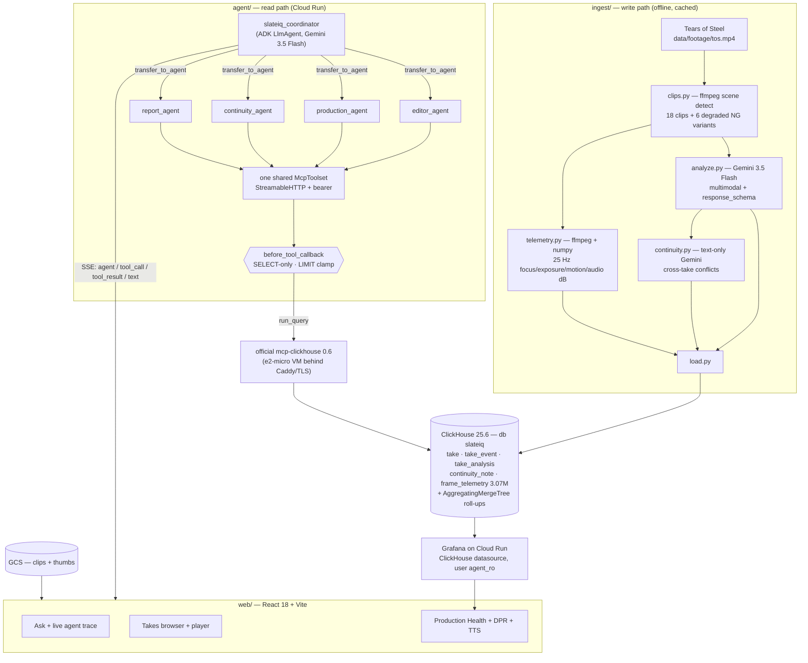

# SlateIQ

**A day of dailies, turned into a database you can ask questions of.**

*Agentic Cinema: The Blockbuster Hackathon — **ClickHouse partner track***

---

At 1 a.m. after a fourteen-hour day, three people on a film crew are still working: the **script
supervisor** finishing the lined script and facing pages, the production office reconciling the
**Daily Progress Report**, and tomorrow morning an assistant editor who will watch two to four hours
of dailies so somebody in the cutting room knows what is in there. Call it **≈3 crew-hours per
shooting day — ≈90 hours, about two crew-weeks, over a 30-day feature** — and at the end of it the
knowledge lands in PDFs where nobody can ask it anything. SlateIQ fixes the shape of the problem
rather than the paperwork: **Gemini watches every take and writes structured, timestamped knowledge
into ClickHouse**, and a **Google Cloud Agent Builder (Agent Development Kit / ADK)** crew —
coordinator plus four specialists modelled on the editor, the script supervisor, the 1st AD and the
producer — answers their questions in English by writing SQL and running it **through the official
`mcp-clickhouse` MCP server at runtime**, then generates the documents themselves: the Daily
Progress Report, the Editor's Log of **circled takes**, continuity alerts, and a Gemini-TTS read of
the ninety-word version for the drive home.

The thing no incumbent can do sits one join away: Gemini's *semantic* judgement (this take was
circled) against **3.07 M rows of independently measured frame telemetry** (this take is soft for
13 seconds). See [the catch](#the-catch-the-query-no-dailies-tool-can-answer).

---

## Stage-1 compliance

| Requirement | How SlateIQ meets it | Evidence |
|---|---|---|
| **Gemini models** | `gemini-3.5-flash` — multimodal take analysis with a pydantic `response_schema`, and *all* agent reasoning. `gemini-2.5-flash-preview-tts` for the spoken report. `gemini-3.1-pro-preview` optional for richer DPRs. | [`agent/slateiq_agent/config.py:26-29`](agent/slateiq_agent/config.py) · [`ingest/analyze.py`](ingest/analyze.py) |
| **Google Cloud Agent Builder (Agent Development Kit / ADK)** — multi-agent | ADK 2.8. `slateiq_coordinator` (`LlmAgent`) routes via `transfer_to_agent` to **4 specialists**: `editor_agent`, `production_agent`, `continuity_agent`, `report_agent`. | [`agent/slateiq_agent/agent.py:44-49`](agent/slateiq_agent/agent.py) (`SUB_AGENT_NAMES`), `:101-160` (builders) · `google-adk` in [`agent/requirements.txt`](agent/requirements.txt) |
| **ClickHouse via the OFFICIAL `mcp-clickhouse`, at runtime** | Every analytical answer is SQL the agent wrote and executed through one shared ADK `McpToolset` over StreamableHTTP. The specialists have **no other data tool** — there is no database driver on the reasoning path. | [`agent/slateiq_agent/agent.py:53-74`](agent/slateiq_agent/agent.py) (`build_clickhouse_toolset` → `StreamableHTTPConnectionParams`), `:79-99` (`tools=[toolset]`) · [`config.py:33-36`](agent/slateiq_agent/config.py) (`CLICKHOUSE_MCP_URL`) · [`runtime.py:179`](agent/slateiq_agent/runtime.py) (`run_query` SQL captured for the trace) · [`guardrails.py:127`](agent/slateiq_agent/guardrails.py) (`if tool.name != "run_query"`) · `mcp-clickhouse==0.6.0` in [`deploy/vm/compose/`](deploy/vm/compose) |
| **Cloud Run** | `slateiq` (agent API + React UI) and `slateiq-grafana`, both `--min-instances 0`. | [`deploy/cloudrun/deploy_agent.sh`](deploy/cloudrun/deploy_agent.sh) · [`deploy/grafana/deploy.sh`](deploy/grafana/deploy.sh) |
| **Google Cloud Storage** | Public bucket `slateiq-media-<project>` serves clips + thumbnails with immutable cache headers. | [`deploy/gcs/publish_clips.sh`](deploy/gcs/publish_clips.sh) |
| **Secret Manager** | `slateiq-google-api-key`, `slateiq-ch-ro-password` — mounted as env vars on Cloud Run; superseded versions destroyed to stay inside the free 6-version budget. | [`deploy/README.md §3`](deploy/README.md) |
| **Also** | Compute Engine e2-micro (data plane), Artifact Registry, Cloud Build. | [`deploy/cost.md`](deploy/cost.md) |
| **License** | **Apache-2.0** | [`LICENSE`](LICENSE) |
| **Footage attribution** | Demo dailies are cut from ***Tears of Steel*** © **Blender Foundation**, [mango.blender.org](https://mango.blender.org/), licensed [**CC BY 3.0**](https://creativecommons.org/licenses/by/3.0/). SlateIQ is not affiliated with the Blender Foundation. | [`ingest/README.md`](ingest/README.md) · About screen in the UI |

**No non-Google model APIs anywhere in the product.** The agents call Gemini; the data path is
`mcp-clickhouse`; nothing else.

---

## Live

| | |
|---|---|
| **App (Cloud Run)** | <https://slateiq-957930801789.us-central1.run.app> |
| **Video (≤3 min, YouTube)** | _uploading — the link lands here and in [`deploy/OUTPUT.md`](deploy/OUTPUT.md) before submission_ |
| **Grafana — Production Health** | <https://slateiq-grafana-hbissixc2q-uc.a.run.app/d/slateiq-prod-health> (anonymous, read-only) |
| **ClickHouse MCP endpoint** (bearer-token protected) | `https://35.239.36.85.sslip.io/mcp` · health: <https://35.239.36.85.sslip.io/health> |
| **Clips + poster frames (GCS)** | `https://storage.googleapis.com/slateiq-media-gke-hackathon-472816` |
| **Repo** | <https://github.com/kaitorecca/slateiq> |

> Cloud Run runs at `min-instances 0` on the free tier, because idle instances cost money and a
> hackathon budget is zero. **A cold start is ~16 s** — measured from the Cloud Run logs, container
> start to `Application startup complete`; it is the ADK import, not the database. Warm requests
> are **~0.6 s** to the UI and to `/api/health`. If the first click feels slow, that is the whole
> explanation; everything after it is warm. (Keeping it warm would mean `min-instances 1`, which
> leaves the free tier, so we chose the honest number over the invisible bill.)

Reproduce the partner call in ten seconds — the SSE stream emits the `run_query` tool call, the
generated SQL and the row count as they happen:

```bash
curl -N -X POST https://slateiq-957930801789.us-central1.run.app/api/chat \
  -H 'Content-Type: application/json' \
  -d '{"message":"Which takes have boom in shot on day 12?"}'
```

```
event: agent
data: {"name":"editor_agent"}
event: tool_call
data: {"name":"run_query","args":{"query":"SELECT e.take_id, e.flag_type, e.severity, e.t_offset_s FROM slateiq.take_event e JOIN slateiq.take t USING take_id WHERE t.day_number = 12 AND e.flag_type = 'boom_in_shot' ORDER BY e.severity DESC LIMIT 200"}}
event: tool_result
data: {"name":"run_query","rows":8,"summary":"8 rows"}
```

`GET /api/health` reports the model and the live MCP endpoint; the UI header shows it as a green dot.

---

## Screenshots

| | |
|---|---|
|  |  |
| **Ask** — streaming answer, take cards that seek to the cited timestamp | **Trace** — `mcp-clickhouse` · `run_query` · the SQL · rows · latency |
|  |  |
| **Takes** — scene/status filters, flag chips, transcript timeline | **Production Health** — Grafana panels + generated Daily Progress Report |

---

## Architecture



Full design notes, the request-flow sequence diagram and the trade-offs: **[`docs/ARCHITECTURE.md`](docs/ARCHITECTURE.md)**.

---

## How it works

**1 — Ingest writes the knowledge.** `ffmpeg` scene-detects the source footage into 18 takes and
renders 6 deliberately degraded NG variants (blur → soft focus, `drawbox` → boom in shot,
`volume=10.0` → audio clipping, animated crop → frame-edge drift). Each *original* goes to
**Gemini 3.5 Flash** with a strict pydantic `response_schema`: transcript with speakers, action
beats, quality flags, emotional intensity, a circle-worthy recommendation. In parallel and
**without ever being told what the defect is**, `telemetry.py` measures the file itself at 25 Hz —
focus, exposure, motion, audio peak in dBFS. Every Gemini result is cached to `data/cache/` and
committed, so a clean checkout replays the pipeline for **zero API calls**. Total video sent to
Gemini: **263 s**, against a 15-minute hard budget.

**2 — ClickHouse is the production brain.** Eight base tables plus `AggregatingMergeTree` roll-ups
behind three views (`daily_progress`, `scene_progress`, `flag_summary`). The 30-day shoot around
the real day-12 dailies is deterministic synthetic data, so schedule, overtime and risk questions
have thirty days of history to reason over. [`db/SCHEMA.md`](db/SCHEMA.md) is the **contract** — it
is injected verbatim into the agent instructions and re-read when its mtime changes.

**3 — Agents answer.** The coordinator routes to a specialist; the specialist writes SQL against
that contract and calls `run_query` on the **official `mcp-clickhouse`** toolset. A
`before_tool_callback` enforces a single read-only `SELECT`/`WITH`, rejects anything destructive,
and *appends or clamps* the `LIMIT` to 200 rather than bouncing the call. The executed SQL is
recorded on session state and streamed to the UI.

**4 — Documents come out.** `report_agent` builds the **Daily Progress Report** (scenes, pages in
eighths, setups, takes, circled, NG, print ratio, wrap and overtime) and the **Editor's Log** — the
digital form of the script supervisor's facing pages — entirely from live queries, then Gemini TTS
reads the short version aloud. The Editor's Log also exports straight into the cutting room:
`GET /api/export/editors-log?day=12&format=csv|ale|md` — the **ALE (Avid Log Exchange)** file drops
the day's circled takes, with Gemini's notes and flags as bin columns, into Avid Media Composer or Resolve.

---

## The catch — the query no dailies tool can answer

> *"Which circled takes are measurably soft?"*

```sql
SELECT t.take_id, t.scene_number, t.shot, t.take_number,
       round(countIf(f.focus_score < 0.55) / 25, 1) AS soft_s,
       round(avg(f.focus_score), 3)                 AS avg_focus
FROM slateiq.frame_telemetry f
JOIN slateiq.take t USING take_id
WHERE t.status = 'circled'
GROUP BY t.take_id, t.scene_number, t.shot, t.take_number
HAVING soft_s > 5
ORDER BY soft_s DESC;
```

| take_id | scene | shot | take | soft_s | avg_focus |
|---|---|---|---|---|---|
| `TOS-D12-S12-B-02-B` | 12 | B | 2 | **13.0** | **0.521** |

Director's note on that take: *"Cleaner. Print."* It was **circled** — and it sits under the focus
threshold for thirteen seconds. Nobody caught it on set.

**58 ms · 3,086,083 rows read · 95.5 MB scanned**, measured on the demo box. That query joins
Gemini's semantic judgement to physically measured telemetry, and it is why ClickHouse is in this
product rather than a Postgres table with a sponsor logo on it.

---

## The dataset

One production, `production_id = 'tos2026'` — *Tears of Steel* fictionalised as a 30-shooting-day
feature in Amsterdam. **Day 12 (2026-09-04) is today**; days 1–12 are shot, days 13–30 are scheduled
only, so schedule-risk questions have something to forecast. Days 8 and 11 lost setups to rain.

| Table | Rows | What |
|---|---:|---|
| `production` | 1 | title, start date, planned days, director, DP |
| `scene` | 120 | scene number (never numeric — `14A`), slug, INT/EXT, DAY/NIGHT, page eighths, characters |
| `shooting_day` | 30 | call time, planned/actual wrap, planned scenes, weather |
| `take` | **2,503** | slate: scene, setup, take no, camera, roll, sound roll, `tc_in`, duration, status, lens, fps, ISO |
| `take_event` | **26,750** | timestamped: 15,108 dialogue lines, **732 quality flags**, action, slate, emotion, camera |
| `take_analysis` | 2,503 | Gemini summary, transcript, quality score, emotion intensity, recommendation |
| `continuity_note` | 66 | cross-take conflicts: wardrobe, props, screen direction, action match … |
| `frame_telemetry` | **3,074,957** | 25 Hz per take — focus, exposure EV, motion, audio peak/RMS in dBFS |
| | **53.6 MiB on disk** | (ClickHouse compression on 3.1 M rows) |

Take status: 1,322 `hold` · 586 `ng` · 524 `circled` · 54 `wild` · 17 `pending`.

**Day 12** (the day the real Gemini-analysed clips land, scenes `12, 14A, 27, 33, 41, 56, 78, 102`):
175 takes · 31 setups · 38 circled · 42 NG · 9 3/8 pages · 130 camera-minutes · **wrapped 15 minutes
over**. **To date: 48 4/8 pages shot of 52 planned — three and a half pages behind, about half a day.**

Every number on this page is a live query against that database. `db/verify.py` runs 43 checks
including all 15 golden queries in `db/SCHEMA.md`.

---

## Run it locally

**Prerequisites:** Python 3.12, Node 24, Docker, `ffmpeg`, and a Gemini API key.

Two virtualenvs, on purpose: **ADK 2.8 pins `mcp` 1.x while `mcp-clickhouse` needs `mcp` 2.x**, so
the MCP server lives in its own environment and is reached over HTTP.

```bash
git clone https://github.com/kaitorecca/slateiq.git && cd slateiq

# 0 — env
cat > .env <<'EOF'
GOOGLE_API_KEY=<your Gemini API key>
GEMINI_API_KEY=<same>
CLICKHOUSE_HOST=localhost
CLICKHOUSE_PORT=8123
CLICKHOUSE_USER=default
CLICKHOUSE_PASSWORD=clickhouse
CLICKHOUSE_MCP_URL=http://localhost:8765/mcp
EOF
set -a; source .env; set +a

# 1 — ClickHouse
docker run -d --name slateiq-ch -p 8123:8123 -p 9000:9000 \
  -e CLICKHOUSE_PASSWORD=clickhouse clickhouse/clickhouse-server:25.6

# 2 — venvs
python3 -m venv .venv      && .venv/bin/pip install -r agent/requirements.txt
python3 -m venv .venv-mcp  && .venv-mcp/bin/pip install 'mcp-clickhouse==0.6.0'

# 3 — data: 30-day synthetic shoot + real day-12 dailies (Gemini results are cached in-repo → free)
.venv/bin/python db/generate_synthetic.py --reset     # ~4 s
./ingest/run_all.sh                                   # replays from data/cache/
.venv/bin/python db/verify.py                         # 43 checks, non-zero exit on failure

# 4 — the official ClickHouse MCP server
scripts/mcp_up.sh &                                   # http://localhost:8765/mcp  (health: /health)

# 5 — the agent + UI
source .venv/bin/activate && cd agent && uvicorn main:app --port 8811
```

Open **<http://localhost:8811/>** for the app, `/dev-ui/` for the ADK developer UI (agent tree and
traces), `/docs` for OpenAPI.

Front-end development with hot reload (Vite on **5188**, proxying `/api` to 8811):

```bash
cd web && npm install && npm run dev       # or `npm run mock` for a zero-dependency fake API
```

> Ports: **8811** SlateIQ API · **5188** Vite · **8765** `mcp-clickhouse` · **8123** ClickHouse HTTP.
> (8080/3000/8000 are deliberately avoided — they are taken on the dev box.)

Ask it something:

```bash
curl -N -X POST localhost:8811/api/chat -H 'Content-Type: application/json' \
  -d '{"message":"Are we on schedule after day 12?"}'
```

---

## Deploy it

One VM for the data plane, two scale-to-zero Cloud Run services, one GCS bucket — **$0 on the
Always Free tier**. Full runbook and the cost arithmetic:
**[`deploy/README.md`](deploy/README.md)** · **[`deploy/cost.md`](deploy/cost.md)**.

```bash
deploy/vm/create_vm.sh          # e2-micro + firewall
deploy/vm/deploy_stack.sh       # ClickHouse + mcp-clickhouse + Caddy (Let's Encrypt via sslip.io)
deploy/vm/seed_remote.sh        # local ClickHouse -> Parquet -> hosted, chunked
deploy/gcs/publish_clips.sh     # clips + thumbs to a public bucket
deploy/cloudrun/deploy_agent.sh # agent + UI, API key from Secret Manager
deploy/grafana/deploy.sh        # Production Health dashboard
```

Every script is idempotent. Live URLs and row-count assertions land in `deploy/OUTPUT.md`.

---

## Evals

28 real questions across all five agents and all four personas — editor, script supervisor, 1st AD,
producer, director — run through the **real coordinator against the real MCP server**, recording
routing, every tool call, the SQL, the latency, and whether `run_query` was actually reached. A
Gemini judge then scores each answer 1–5 against a per-question rubric. **The harness exits non-zero
if any question marked `must_query` produced an answer without touching MCP.**

Latest run: **28/28 reached `mcp-clickhouse` `run_query`** · **27/28 routed to the expected
specialist** · judge **mean 4.82/5, median 5.0** (27/28 at 4+) · median latency **27.3 s**.

```bash
source .venv/bin/activate && set -a && source .env && set +a
python agent/evals/run_eval.py                       # all 28, judged
python agent/evals/run_eval.py --only dpr forecast   # a subset
```

Full transcript, per-question SQL and judge reasoning: **[`agent/evals/last_run.md`](agent/evals/last_run.md)**
(machine-readable: `last_run.json`).

---

## Repo layout

| Path | What |
|---|---|
| [`db/`](db/README.md) | ClickHouse DDL, the deterministic 30-day synthetic shoot, `verify.py`, and **`SCHEMA.md` — the agent-facing contract** |
| [`ingest/`](ingest/README.md) | ffmpeg clip splitting + degradations, Gemini multimodal analysis, 25 Hz telemetry, continuity notes → ClickHouse |
| [`agent/`](agent/README.md) | the ADK package `slateiq_agent/` (coordinator + 4 specialists, MCP toolset, guardrails, runtime), FastAPI `main.py`, `evals/` |
| [`web/`](web/README.md) | React 18 + Vite + Tailwind SPA — Ask, Takes, Production Health, About; `dist/` committed |
| [`deploy/`](deploy/README.md) | VM bootstrap + compose, Cloud Run deploy scripts, Grafana provisioning, GCS publish, [`cost.md`](deploy/cost.md) |
| [`docs/`](docs/) | [`ARCHITECTURE.md`](docs/ARCHITECTURE.md), [`PLAN.md`](docs/PLAN.md), [`DEVPOST.md`](docs/DEVPOST.md), [`DEMO_SCRIPT.md`](docs/DEMO_SCRIPT.md), [`JUDGE_REVIEW_1.md`](docs/JUDGE_REVIEW_1.md), `TRACKING.md` |
| `scripts/` | `mcp_up.sh` — starts the official `mcp-clickhouse` on 8765 |
| `data/` | `cache/` (Gemini results, **committed**); clips, thumbs and footage are gitignored and published to GCS |

---

## A note on terminology

Domain vocabulary is used precisely, because a script supervisor on the judging panel would notice.

- **Print ratio**, not shooting ratio. SlateIQ reports `takes / circled` — takes shot per printed
  take — and calls it **print ratio** (or takes-per-print). **Shooting ratio** is a different
  measure: material *shot* against material in the *finished cut* (e.g. 10:1). Conflating them is
  the single most common tell in a production tool written by someone who has never been on a set.
- **Daily Progress Report**, not Daily Production Report. What SlateIQ generates — scenes shot,
  added or deleted, setups, page counts, takes, circled, NG, wrap — is the narrower
  script-supervisor/AD-department **Progress Report**. The **Daily Production Report (DPR)** is the
  2nd AD's counterpart to the call sheet, covering crew, cast times, meals, hours and media. We do
  not silently equate them; the full Production Report is future work.
- **Circled takes.** The **director designates** the preferred take; the **script supervisor
  records and circles it**, and it is marked on the camera and sound reports so dailies and
  editorial prioritise it.
- **Page eighths.** A page is treated as eight inches; the 1st AD measures it for the stripboard
  (~1 page ≈ 1 minute of screen time). Rendered as `2 4/8` — and **8/8 is always written "1 page"**.
- **Setups** = `uniqExact(scene_number, shot)`. A 2-camera setup is **two take rows, one setup**.
- **Editor's Log** is the digital form of the script supervisor's **facing pages**.
- Statuses **`circled` / `ng` / `hold` / `wild`** carry their set meanings — `wild` is sound-only,
  `hold` is usable but not printed.

---

## Roadmap

- **Camera report and sound report per roll.** `roll`, `sound_roll`, `lens_mm`, `fps`, `iso` and
  `tc_in` are already stored — that is ~80% of a camera report, and it completes the paperwork story.
- **The full 2nd AD Daily Production Report** — crew, cast times, meal penalties, media totals —
  alongside the Progress Report.
- **The lined script, reconstructed** from `take_event` coverage: which setup covered which line,
  straight line where the face is visible, squiggle where it is not.
- **Live from set.** Ingest from Camera-to-Cloud proxies as they land instead of a nightly batch.
- **A second MCP server.** [`grafana/mcp-grafana`](https://github.com/grafana/mcp-grafana) attached
  as a second `McpToolset` so the agent can answer "which dashboard already shows this?" and cite a
  panel instead of re-deriving the number — `mcp-clickhouse` writes new analysis, `mcp-grafana`
  reuses existing analysis. Sketched in [`deploy/README.md §4`](deploy/README.md).
- **Multi-production tenancy** and a real `production_id` filter through the agent prompts.
- **Editorial hand-off** — a genuine EDL/ALE export of the circled-take list, not an EDL-ish table.

---

## Where SlateIQ sits

**Frame.io Camera to Cloud** and **Moxion** own *transport* — proxies and secure review seconds
after the cut. They move dailies brilliantly; they do not reason about them. **Strada** is the
closest neighbour — AI auto-tagging, transcription, agents — but it searches *media*, and it cannot
tell you that you are three and a half pages behind. **ScriptE** genuinely does produce a progress
report and an editor report, from a script supervisor typing into forms all day; it answers the
questions its forms were designed for. **Filmustage** does natural language over the
*pre-production* breakdown. Nobody joins the set-generated structured data to the media and opens
both to analytical query. That join is the whole product.

---

## License & credits

Code: **Apache License 2.0** — see [`LICENSE`](LICENSE).

Footage: ***Tears of Steel*** © **Blender Foundation** — [mango.blender.org](https://mango.blender.org/)
— licensed **[CC BY 3.0](https://creativecommons.org/licenses/by/3.0/)**, used here as stand-in
dailies. SlateIQ is not affiliated with or endorsed by the Blender Foundation.

Built with the **Google Cloud Agent Development Kit (Agent Builder)**, **Gemini**, and the official
**[`mcp-clickhouse`](https://github.com/ClickHouse/mcp-clickhouse)** MCP server on **ClickHouse**.
