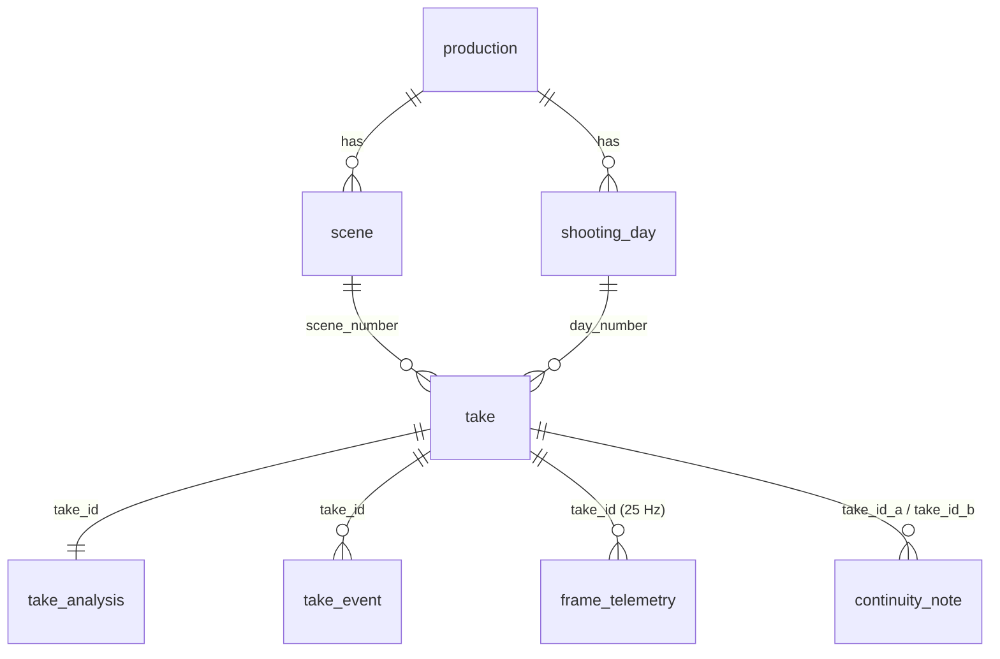
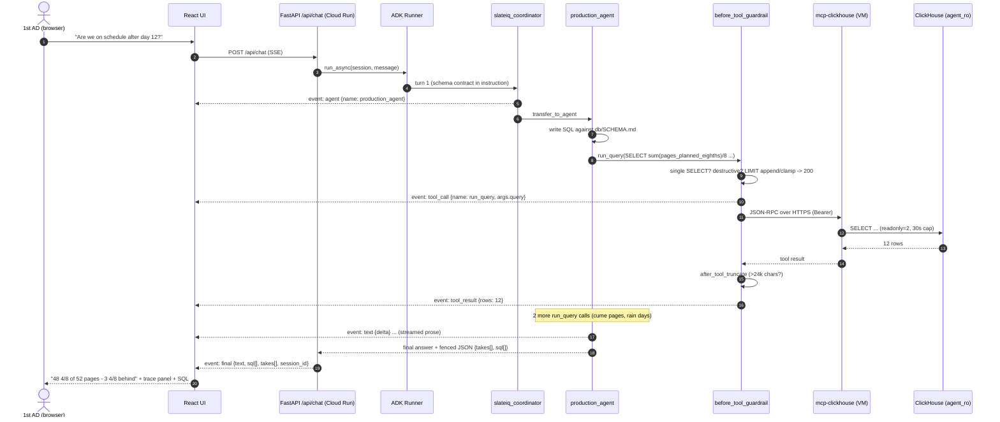

# SlateIQ — Architecture

Design notes for the SlateIQ dailies-intelligence system. The root [`README.md`](../README.md)
covers what it is and how to run it; this document covers **why it is shaped this way**.

The one-line summary: **Gemini writes the rows that ClickHouse later answers from, and the only
path between the agents and the data is the official `mcp-clickhouse` MCP server.**

---

## 1. Components and responsibilities

| Component | Owns | Explicitly does *not* own |
|---|---|---|
| **`ingest/`** — write path | Turning footage into rows: ffmpeg clip splitting and degradation, Gemini multimodal analysis under a pydantic `response_schema`, 25 Hz frame telemetry measured from the file, text-only cross-take continuity notes, and the ClickHouse insert. Day 12, scenes `12, 14A, 27, 33, 41, 56, 78, 102`. | The schema (that is `db/`'s), and anything at query time. It runs offline, is idempotent, and replays from `data/cache/` for zero API calls. |
| **`db/`** — the contract | DDL for the eight base tables, two `AggregatingMergeTree` roll-ups and three dashboard views; the deterministic 30-day synthetic shoot around the real day-12 dailies; `verify.py` (43 checks, every golden query); and **`SCHEMA.md`**, which is a prompt, not documentation. | Any runtime path. Its `clickhouse-connect` usage is seed/admin only. |
| **`agent/`** — read path | The ADK network (coordinator + 4 specialists), the shared `McpToolset`, the guardrail callbacks, event normalisation, the FastAPI surface (SSE chat, reports, TTS, health, static UI). | Writing to the database. The single `clickhouse-connect` call in the service is the `/api/takes` gallery listing — a dumb `SELECT` for thumbnails with no model in the loop, labelled as such in `main.py`. |
| **`web/`** — the surface | Four screens (Ask, Takes, Production Health, About), the live agent-trace panel, the player that seeks to a cited timestamp, Grafana embeds, markdown report rendering, TTS playback. | Any business logic about film production. It renders what the SSE stream and the JSON contract give it. |
| **`deploy/`** — the substrate | One e2-micro carrying ClickHouse + `mcp-clickhouse` + Caddy; two scale-to-zero Cloud Run services; a public GCS bucket; Secret Manager; the seeding pipeline. | Application behaviour. Every script is idempotent and converges. |

### The agent network

```
                       slateiq_coordinator  (LlmAgent, gemini-3.5-flash)
                       routes by transfer_to_agent; owns the conversation
        ┌───────────────────┬──────────────────┬───────────────────┐
   editor_agent      production_agent    continuity_agent     report_agent
   takes, lines,     schedule, pages,    cross-take           Daily Progress
   flags, clips,     print ratio,        conflicts, line      Report + Editor's
   quality           risk, overtime      variations           Log (markdown)
        └───────────────────┴──────────────────┴───────────────────┘
                                    │
                    ONE shared McpToolset (StreamableHTTP)
                                    │
                   official mcp-clickhouse  →  ClickHouse `slateiq`
```

Four specialists rather than one agent with four prompts, because each persona has a different
*failure mode*, and the instruction that fixes one breaks another. The editor needs take ids, clip
URIs and seek offsets; the producer needs aggregates and must never row-dump; the continuity agent
needs pairwise comparison across takes; the report agent needs a fixed document skeleton and a
larger query budget (8 rather than 6 `run_query` calls). Routing is ADK's `transfer_to_agent`, so
the coordinator's job is one decision, not four playbooks.

**One `McpToolset` instance is shared by all five agents** ([`agent/slateiq_agent/agent.py:53-77`](../agent/slateiq_agent/agent.py)).
ADK 2.8 reparents *sub-agents* but not *toolsets*: constructing one per agent would open five MCP
sessions against a 1 GiB VM for no benefit. One instance means one connection for the whole network,
closed once at shutdown.

---

## 2. Why MCP-over-HTTP as a separate service

This is the least obvious decision in the repo, and it is forced.

**ADK 2.8 pins `mcp` 1.x. `mcp-clickhouse` 0.6 requires `mcp` 2.x.** They cannot coexist in one
Python environment. The options were:

1. **Vendor or fork `mcp-clickhouse`** to run on `mcp` 1.x — which would mean the agent no longer
   uses *the official server*, defeating the entire point of the partner track.
2. **Pin ADK back** to a release compatible with `mcp` 2.x — none exists that also has the
   `StreamableHTTPConnectionParams` and multi-agent behaviour this design relies on.
3. **Run the MCP server out-of-process and speak HTTP to it.** ← chosen.

So `mcp-clickhouse` lives in its own environment — `.venv-mcp/` locally, its own container in
production — and ADK reaches it with `StreamableHTTPConnectionParams(url=..., headers=..., timeout=30,
sse_read_timeout=300)`. The dependency conflict never has to be resolved because the two halves
never share an interpreter.

This turns out to be the *better* architecture regardless of the version clash:

- **It is the honest topology.** MCP is a protocol precisely so the server can be a separate
  process owned by someone else. Running the vendor's published server unmodified, over the wire,
  is a stronger claim of "official partner server at runtime" than importing its internals.
- **It survives Cloud Run.** The agent container scales to zero and back; the data plane does not
  move. A stdio child process would be re-forked on every cold start and would have to carry
  ClickHouse credentials into the stateless tier.
- **The seam is auditable.** Everything the agent asks of ClickHouse crosses one HTTPS boundary
  with one bearer token, so it can be logged, rate-limited by Caddy, and proven from outside the
  process.
- **`sse_read_timeout=300`** matters: the report agent's DPR run issues ~18 queries in one turn and
  the default read timeout would sever the stream mid-document.

The cost is one network hop (single-digit milliseconds inside `us-central1`) and one more thing that
can be down — which is why `/api/health` surfaces the MCP endpoint and the UI renders it as a dot.

---

## 3. Guardrails — SQL written by a model is still SQL

Two ADK callbacks wrap every tool call ([`agent/slateiq_agent/guardrails.py`](../agent/slateiq_agent/guardrails.py)).

**`before_tool_callback` → `enforce()`**, on every `run_query` (`guardrails.py:127`):

- The statement must be **single** and must start with `SELECT` or `WITH` (and a `WITH` block must
  actually contain a `SELECT`). Statement stacking is rejected.
- Destructive verbs — `INSERT INTO`, `DROP`, `ALTER TABLE`, `TRUNCATE`, `GRANT`, `SYSTEM FLUSH`,
  `ATTACH`/`DETACH` — and `INTO OUTFILE` are rejected with an **explanatory tool result the model
  can recover from**, not an exception. A refusal the model can read is worth more than a stack
  trace it cannot.
- A missing `LIMIT` is **appended** and an oversized trailing `LIMIT` is **clamped** to
  `SLATEIQ_MAX_ROWS` (200) rather than bounced — a `LIMIT` inside a subquery is left alone. The
  model does not burn a round trip on a mistake that is mechanically fixable, and **the rewritten
  SQL is what actually executes**.
- The executed SQL is recorded on session state (`slateiq_sql`) so the trace panel and the `final`
  SSE event show the *real* query, not the one the model proposed.

**`after_tool_callback` → `after_tool_truncate`**: any result over `SLATEIQ_MAX_TOOL_RESULT_CHARS`
(24,000) is truncated and the model is told to re-query with tighter filters. `frame_telemetry`
alone is 3.07 M rows; without this, one careless `SELECT *` costs the whole context window.

**Defence in depth.** The callback is the first of three layers, and it is the only one an
attacker-controlled prompt can even reach:

| Layer | Enforced by | What it stops |
|---|---|---|
| Prompt | `prompts.py` SQL rules, per-agent query budgets | most of it, cheaply |
| Callback | `before_tool_guardrail` (in-process, deterministic) | anything the prompt failed to stop |
| Database | ClickHouse user **`agent_ro`**: `readonly=2`, `allow_ddl=0`, 30 s timeout, 20k-row cap, 240 queries/min quota | anything that gets past both — including a compromised MCP server |

The last row is the one that actually matters: even a total failure of the two upper layers cannot
write, because the credential physically cannot.

---

## 4. Schema as a contract

`db/SCHEMA.md` is **injected verbatim into every agent's instruction** and re-read whenever its
mtime changes ([`agent/slateiq_agent/schema.py`](../agent/slateiq_agent/schema.py); an embedded
summary is the fallback if the file is missing, so the container still works if the mount is not
there). This makes it a hard interface with three properties:

- **Single source of truth.** If a column changes, it changes in `SCHEMA.md`, and the agents see it
  on the next request without a redeploy or a prompt edit.
- **Budgeted.** It is kept under 6 KB. Every agent pays for it on every turn; a schema dump of a
  120-table warehouse would be unaffordable, which is the real reason text-to-SQL agents fail at
  scale. Curation is the feature.
- **Carries the traps, not just the columns.** `scene_number` is never numeric (`'14A'`);
  `page_eighths / 8.0` is pages; a take row is *one camera's slate*, so setups are
  `uniqExact(scene_number, shot)`; days 8 and 11 lost setups to rain so `pages_shot < pages_planned`
  legitimately; guard `print_ratio` with `greatest(circled, 1)`.

**Golden queries.** Fifteen worked Q→SQL examples ship inside the contract, one per user question
the demo cares about. They serve two purposes at once: few-shot grounding for the model, and a
**regression suite** — `db/verify.py` executes all of them plus row-count and invariant checks (43
in total) and exits non-zero on failure. A schema change that breaks a golden query fails the build
*and* is guaranteed to have broken an agent, because they are the same artifact.

`agent/evals/` closes the loop at the semantic level: 16 questions run through the real coordinator
against the real MCP server, judged by Gemini against per-question rubrics, and the harness **fails
the run if any `must_query` question was answered without touching MCP**. Structural correctness is
`verify.py`; behavioural correctness is `run_eval.py`.

---

## 5. Why ClickHouse

Not because a track required it — because the workload is genuinely columnar.

**A film shoot is an event stream wearing a clipboard.** Slates, takes, timecode, dialogue lines,
flags, continuity notes: append-only, timestamped, never updated after the fact, always read as
aggregates over a range. That is the shape ClickHouse is built for, and it is the shape a
row-oriented OLTP store is worst at.

**The telemetry table is what makes it non-negotiable.** `frame_telemetry` is 25 rows per second per
take — **3,074,957 rows**, and that is one 30-day shoot at 720p. A real feature with multiple
cameras and higher frame rates is an order of magnitude more. It compresses to **53.6 MiB on disk**,
and the hero query — every circled take joined against its own measured focus scores —

```sql
SELECT t.take_id, round(countIf(f.focus_score < 0.55)/25, 1) AS soft_s, round(avg(f.focus_score),3)
FROM slateiq.frame_telemetry f JOIN slateiq.take t USING take_id
WHERE t.status = 'circled' GROUP BY t.take_id HAVING soft_s > 5 ORDER BY soft_s DESC;
```

returns in **58 ms after reading 3,086,083 rows (95.5 MB)** on a free-tier box. Interactivity is the
product: an agent that needs three sequential queries to answer a producer's question can only feel
instant if each one is tens of milliseconds. A store that took two seconds per query would make the
whole conversational premise fail, regardless of how good the reasoning was.

**Roll-ups keep the common path cheap.** Two `AggregatingMergeTree` materialized views
(`take_daily_agg`, `take_scene_agg`) maintain per-day and per-scene aggregates on insert, surfaced as
`daily_progress`, `scene_progress` and `flag_summary`. The agents are told to prefer the views for
report questions, so a Daily Progress Report is a handful of small reads rather than eighteen full
scans.

**And it is the same engine Grafana talks to** — one datasource, one dialect, one set of numbers, so
a dashboard panel and an agent answer cannot disagree.

The trade-off accepted: no updates and no real deletes on the hot path. Base tables are plain
`MergeTree`, so re-ingesting a take means delete-then-insert, and the MVs never see the delete —
`ingest/load.py` rebuilds the two aggregate targets for its own keys after `--replace`. That is a
real sharp edge, documented in `db/README.md`, and the price of the read performance above.

---

## 6. Data model



| Table | Grain | Written by | Read by |
|---|---|---|---|
| `production` | 1 row | `db/` | everything |
| `scene` | script scene (`'14A'`) | `db/` | production, editor |
| `shooting_day` | one of 30 days | `db/` | production (call sheet side) |
| `take` | **one camera's slate** | `db/` + `ingest/` | all |
| `take_analysis` | 1 per take | Gemini via `ingest/`, `db/` for synthetic | editor, director |
| `take_event` | one timestamped event | Gemini + degradation injection | editor, continuity |
| `continuity_note` | a pair of takes | Gemini (text-only) | continuity |
| `frame_telemetry` | **one frame** (25 Hz) | `ffmpeg` + numpy, *never* a model | the join that matters |

Two layers, deliberately kept apart:

- **The semantic layer** — `take_analysis`, `take_event` — is *Gemini's opinion*. Summaries,
  transcripts, flags, emotional intensity, "circle-worthy".
- **The measured layer** — `frame_telemetry` — is *physics*. `ffmpeg` and numpy over the actual
  file: focus score, exposure EV, motion, audio peak and RMS in dBFS. The telemetry extractor is
  never told which clips were degraded and never sees the model output.

Keeping them separate is what makes the product's headline query meaningful. If Gemini also produced
the focus numbers, "circled but measurably soft" would be one model disagreeing with itself. Because
they are independent, it is a **catch** — and the ingest pipeline proves the independence:
`TOS-D12-S41-A-02-A` measures 5.5 s under the focus threshold against 0.0 s for its undegraded
parent, and `TOS-D12-S27-A-02-A` peaks at 0.0 dBFS against −1.2 dBFS, without telemetry ever knowing
a degradation was applied.

**Real and synthetic, on purpose.** Day 12's 175 takes across eight scenes come from real footage
through real Gemini calls. The surrounding 30-day shoot is deterministic synthetic data
(seed `20260905`), because schedule, overtime, print-ratio and risk questions need *history* — and
analysing 30 days of video would blow both the 15-minute Gemini budget and the cost constraint. The
boundary is documented rather than blurred: `db/README.md` and `ingest/README.md` each state exactly
which rows they own.

---

## 7. Request flow



Two contracts hang off this flow:

- **The SSE event contract** (`session` · `agent` · `text` · `tool_call` · `tool_result` · `final` ·
  `error` · `done`). `tool_call` and `tool_result` are emitted **as they happen, never batched** —
  the trace panel is the visible proof that the partner server is used at runtime, and proof that
  arrives after the answer proves nothing.
- **The structured take block.** When an answer references takes, the agent appends a fenced JSON
  block — `{"takes":[{take_id, clip_uri, t, label, reason}], "sql":[...]}`, at most 12 takes — as
  the last thing in the message. `runtime.parse_structured_block()` extracts it so the `final` event
  carries it pre-parsed. **The prose above it always stands on its own**, so a client that ignores
  the block still gets a complete answer. This is how "show me the take" becomes a player seeking to
  13.6 s rather than a paragraph describing a filename.

Reports (`/api/report/dpr`, `/api/report/editor-log`) take the same path with `report_agent` and a
larger query budget, returning `{day, markdown, sql[], ran_query}` — `ran_query` being an explicit
assertion that the document came from the database rather than from the model's memory.

---

## 8. Deployment topology and cost

```
                                internet
      ┌──────────────────┬──────────────────┬─────────────────────────────────┐
 Cloud Run `slateiq`  Cloud Run          GCS bucket            e2-micro `slateiq-data`
 ADK agent + FastAPI  `slateiq-grafana`  slateiq-media-*       us-central1-a, 1 GiB
 + React dist         Grafana OSS        clips/ thumbs/        ┌──────────────────────┐
 min 0, max 2         min 0, max 1       public read           │ caddy  :80/:443/:8443│
      │                     │                                  │  /mcp  -> mcp:8765   │
      │  MCP over HTTPS     │  ClickHouse HTTP (agent_ro)      │  /ch/* -> ch:8123    │
      │  + bearer token     │  over TLS                        │ mcp-clickhouse 0.6   │
      └─────────────────────┴──────────────────────────────────> clickhouse-server 25.6│
                                                                └──────────────────────┘
```

**Why the data plane is a VM and the reasoning plane is Cloud Run.** ClickHouse wants a warm page
cache, a stable disk and a process that does not die between requests; Cloud Run wants statelessness
and scale-to-zero. Splitting them lets each have what it needs — and it is what makes the bill $0,
because the *only* always-on component is the one that is free.

**Fitting ClickHouse into 1 GiB** is real work, not a default:
`max_server_memory_usage_to_ram_ratio 0.6`, `mark_cache_size 128 MiB`, `uncompressed_cache_size 0`,
`max_concurrent_queries 8`, background pools cut to 4/2/2, merges capped at 1 GiB parts, every system
log except a 3-day-TTL `query_log` disabled, a 2 GiB swapfile with `vm.swappiness=10`, and per-user
limits of `max_memory_usage 400 MB` / `max_threads 2`. The Ops Agent is deliberately **not**
installed — it would cost ~120 MB of the box.

**TLS with no domain:** Caddy takes a Let's Encrypt certificate for `<ip>.sslip.io`, a free wildcard
DNS service. No domain purchase, no Cloud DNS zone, no managed certificate, no load balancer.

**Seeding** ships local ClickHouse → `FORMAT Parquet` (zstd) → `gcloud compute scp` →
`INSERT FROM INFILE` *inside* the container, one chunk at a time, so local disk, VM disk and VM RAM
stay flat regardless of table size. The hosted schema is replayed from
`system.tables.create_table_query` — no second source of truth — and materialized-view *targets* are
detected and never copied, because the MVs repopulate them when the base tables land (copying both
would double-count every aggregate). `frame_telemetry` is chunked by `cityHash64(take_id) % n`,
which needs no `ORDER BY` and produces even chunks over String keys.

**Cost: $0**, every line inside a permanent Always Free allowance rather than a trial — 1 e2-micro,
30 GB pd-standard, two scale-to-zero Cloud Run services, <1 GB in GCS, 2 Secret Manager secrets at
1 active version each, Artifact Registry under 0.5 GB with a cleanup policy. Gemini stays free
because every result is cached to `data/cache/` and committed, and under 4.4 minutes of video is
ever analysed. **The one honest caveat:** Google bills all external IPv4 addresses, ephemeral
included, at ~$0.0035/h ≈ **$2.50/month** — outside the free tier. `create_vm.sh` deliberately does
not reserve a static IP, so stopping the instance stops the charge. Full arithmetic in
[`../deploy/cost.md`](../deploy/cost.md).

---

## 9. Security

- **The database credential cannot write.** `agent_ro` is `readonly=2`, `allow_ddl=0`, with a 30 s
  query timeout, a 20k-row result cap and a 240 queries/min quota. It is the only identity
  `mcp-clickhouse` and Grafana ever use. The `default` admin user is reachable only on localhost
  inside the container and is used solely by seeding.
- **The MCP endpoint is authenticated.** Caddy requires `Authorization: Bearer <token>` on `/mcp`;
  an unauthenticated `POST` must return **401**, and `deploy_stack.sh` asserts exactly that as a
  post-deploy check. ClickHouse's own port is never exposed — only Caddy's `/ch/*` prefix, and only
  to the read-only user.
- **Secrets never enter the repo or an image.** `GOOGLE_API_KEY` and the ClickHouse read-only
  password live in **Secret Manager** and are mounted as env vars at deploy time; superseded
  versions are destroyed. `.env` and `.secrets/` are gitignored, and
  `deploy/cloudrun/gcloudignore.template` is installed as `.gcloudignore` so Cloud Build never even
  uploads `.secrets/`, footage, `node_modules/` or the venvs.
- **SQL injection is not the threat model — prompt injection is.** The agent writes the SQL, so the
  classic parameterisation defence does not apply; the defence is the three layers in §3, of which
  the database-level one holds even if the model is fully subverted.
- **Model output is never executed as code.** The only thing the model can cause to happen is a
  `SELECT` through one tool. There is no shell tool, no file tool, no write tool.
- **`--deletion-protection`** on the VM, and `max-instances` on both Cloud Run services so a runaway
  loop cannot scale into real money.
- Public exposure is deliberate and bounded: the app is `--allow-unauthenticated` (judges must be
  able to open it), Grafana is anonymous `Viewer` with the login form disabled, and the GCS bucket
  is public-read for clips only.

---

## 10. Limitations and future work

**Known limitations, stated plainly:**

- **Latency is the weak point.** Median 45 s per question in the eval run, mean 65.6 s — that is
  multi-turn LLM reasoning with 2–18 sequential tool calls, not database time (which is
  milliseconds). The report agent's 18-query DPR takes ~135 s. Parallel tool calls, a smaller
  routing model and caching the report skeletons are the obvious levers.
- **15/16 on the latest eval, not 16/16.** One question (`line_variations`) hit the 300 s ceiling
  without reaching `run_query`, and two answers scored 1/5 for formatting rather than for wrong
  numbers. It is recorded honestly in [`../agent/evals/last_run.md`](../agent/evals/last_run.md)
  rather than rounded up.
- **One production.** `production_id = 'tos2026'` is assumed throughout the prompts and the joins.
  Multi-tenancy means a filter on every query and a tenant in the session — straightforward, but not
  built.
- **Twelve of thirty days are real; eighteen are scheduled-only, and the 30-day history around the
  real day-12 dailies is synthetic.** This is a deliberate cost decision, disclosed in every README
  that touches it, never presented as production data.
- **Delete-then-insert on `take`** requires rebuilding the two MV aggregate targets by hand
  (`ingest/load.py` does this for its own keys). A `ReplacingMergeTree` or a proper `SummingMergeTree`
  keyed for idempotent upserts would remove the footgun.
- **Cold starts.** `min-instances 0` costs 3–5 s on the first request. Deliberate: a warm instance
  is the easiest way to accidentally spend money on Cloud Run.
- **No auth on the app itself**, no per-user history, no RBAC. A real production has strict need-to-know
  boundaries around dailies; this demo has none.
- **The MCP server is a single point of failure** on a single free VM with an ephemeral IP. If the
  instance restarts, the IP and therefore `PUBLIC_HOST` change, and two deploy scripts must be re-run.

**Future work, roughly in order of value:**

1. **Camera and sound reports per roll** — `roll`, `sound_roll`, `lens_mm`, `fps`, `iso`, `tc_in`
   are already stored; this is ~80% of a camera report for very little work, and it completes the
   paperwork story.
2. **The full 2nd AD Daily Production Report** — crew, cast times, meal penalties, media totals —
   as a distinct document from the Progress Report, rather than conflating the two.
3. **The lined script, reconstructed** from `take_event` coverage: which setup covered which line,
   straight line where the face is visible, squiggle where it is not. The data to derive it already
   exists; it is a rendering problem.
4. **Live ingest from Camera-to-Cloud proxies** as they land, instead of a nightly batch — the
   difference between "ask at 1 a.m." and "ask at lunch".
5. **A second MCP server**, [`grafana/mcp-grafana`](https://github.com/grafana/mcp-grafana), attached
   as a second `McpToolset`: `mcp-clickhouse` writes new analysis, `mcp-grafana` reuses existing
   analysis, and the report agent can cite a panel URL instead of re-deriving a number.
   Sketched in [`../deploy/README.md`](../deploy/README.md) §4.
6. **A learned query cache** — the same six questions are asked every night; the SQL for them should
   not be re-reasoned from scratch each time.
7. **Editorial hand-off**: a genuine EDL/ALE export of the circled-take list, and a round trip back
   from the cutting room so `take.status` reflects what was actually used.

---

*See also:* [`../db/SCHEMA.md`](../db/SCHEMA.md) (the agent contract) ·
[`../agent/README.md`](../agent/README.md) (API and endpoint reference) ·
[`../deploy/README.md`](../deploy/README.md) (runbook) · [`PLAN.md`](PLAN.md) ·
[`JUDGE_REVIEW_1.md`](JUDGE_REVIEW_1.md)
